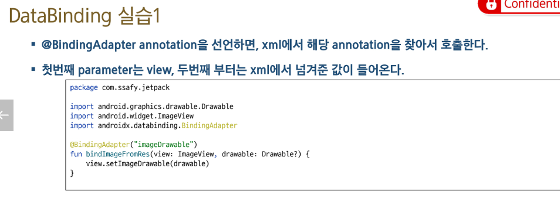
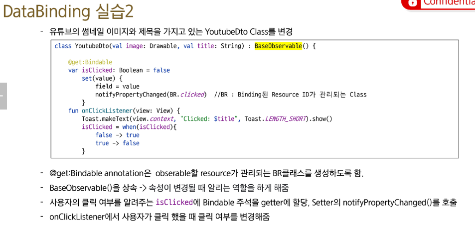
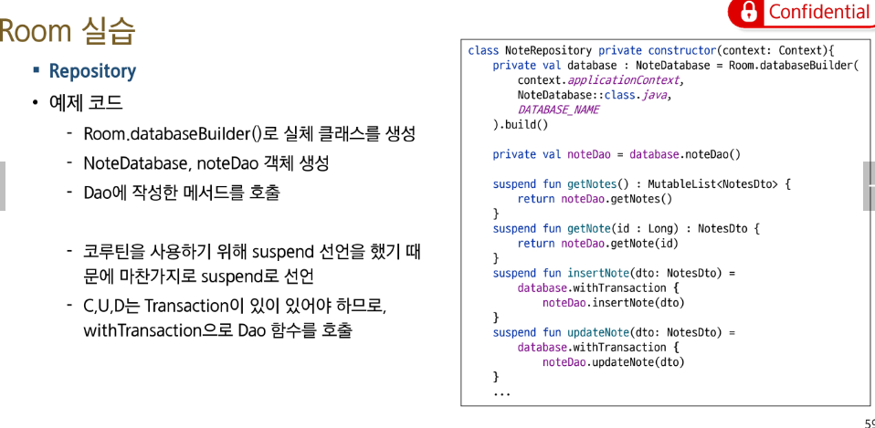
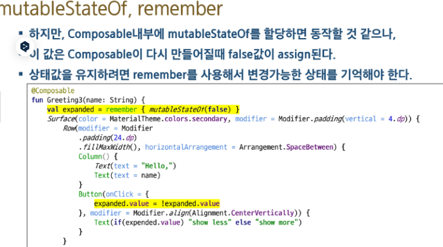
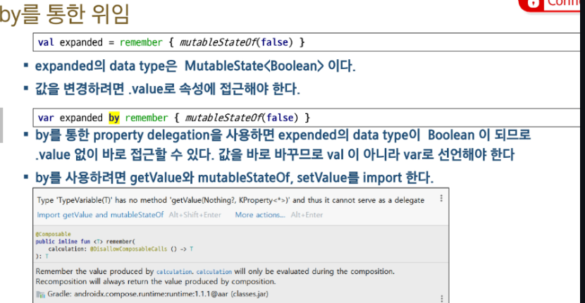
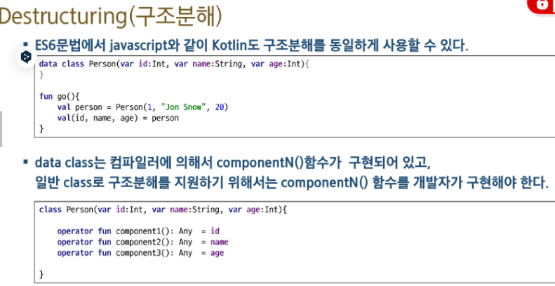
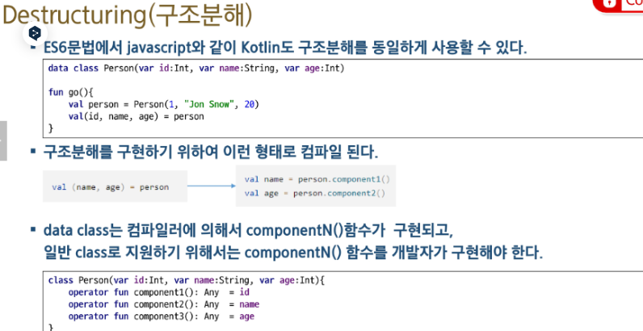

1. MVVM 이랑 VIEW-MODEL의 차이점

안드로이드 뷰모델은 라이프 사이클을 벗어난 인텐트의 역할을 하는 자료구조입니다.

2. ViewModel을 초기화 하는 3가지 방법

일반 : Provider
파라미터 추가 : Provider.Factory
라이브러리 : by viewModels()

```kotlin

-  val viewModel : MainViewModel by lazy {
    ViewModelProvider(this).get(MyViewModel::class.java) 
    }

- val viewModel : ViewModel by lazy {
    ViewModelProvider(this)[(MyViewModel::class.java] 
    }

- val viewModel : ViewModel by lazy {
    ViewModelProvider(this, object : ViewMOdelProvider.Factory{
        ovverride fun< T: ViewModel > create(modelClass:Class<T>): T {
            return ViewModel(0) as T
            }
        }       
    }

- val viewModel : ViewModel by viewModels()
```

3. ViewModel 금지사항

Activity,Fragment,View나 Context를 넣지 마세요!

Context를 참조 하고 있으면 GC로도 정리되지 않습니다. -> 누수가 발생합니다.

4. DataBinding 연결 방법 (Kotlin)

DataBindingUtil 쓰기
- binding = DataBinding.setContentView(this, R.layout.databindingA)

binding.data 쓰기

- binding.data = userList[rand]

레이아웃 선언하기
@BindingAdapter("imageDrawble")
fun bindImageFromRes(view / drawable){
    view.setImageDrawable(drawable)
}



get Bindable



5. MutableLiveData

LiveData는 기본적으로 뷰모델 안에서만 수정이 가능하다, 그래서 MutableLiveData를 LiveData상속으로 만들어서 setValue(), postValue()를 사용해서 수정을 해주고 동기화를 시켜준다.

6. SetValue vs PostValue

SetValue는 메인 쓰레드에서 동작하고 PostValue는 백그라운드 단에서 동작한다.

7. onActive vs onInActive

항상 동작하는게 아니라, 액티비티의 라이프사이클을 따라가면서 동작합니다. 

그게 싫다면 항상 observe하기 위해서 observeForever를 사용합니다.

8. LifeCycleScope

LifeCycleScope와 ViewModelScope를 사용하면 쉽게 정리할 수 있었습니다.
CoroutineScope(Dispatcher.IO)를 사용하지 않아도 됩니다.

9. Room

Room은  ViewModel과 LiveData와 함께 쓰이도록 설계되었으며 Repository라는 중간 객체를 만들어서 Room DB를 관리하도록 합니다.

UI쓰레드 접근을 지양하고 코루틴 기반으로 동작합니다.

10. Room 어노테이션

어떤게 있는지 훑어보면 됩니다. 

@Entity, PrimaryKey, Nonnull, ColumnInfo

@Dao, Queary, Insert, Update, Delete

@Database

11. Repository

Dao와 Network를 모두 관리하는게 좋은 구조라고 했습니다.

12. DatabaseBuilder

레포지토리를 만들때 빌더를 사용했습니다.



13. Compose

선언형(xml) > 명령형(Compose)

14. Compose 문법

@Composable 
: 컴포즈 문법 시작

SetContent > FirstComposeTheme > Surface > modifier, color, ..

@Preview
: 프리뷰

15. Mutable, remember

member variable은 모니터링 대상이 안되기 때문에, mutable, 그리고 remember로 감싸서 사용했습니다.
expended . value , 를 사용했었는데 위의 리멤버를 사용할때 by를 사용 = property delegation이 있었고, destructuring이라는 방법이 있었습니다.









16. Scaffold

17. SAA

18. NavHost, NavController

Navigation.findNavcontroller(view).navigate(R.id. ~~ )


